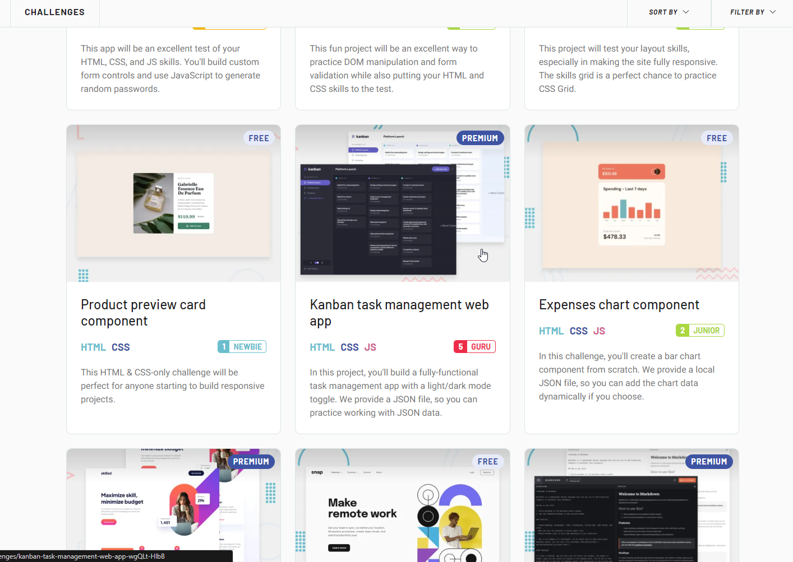

##  Заметки, но как веб-приложение: ##

*** 
#  Вот что в них на данный момент можно делать #

- Создание, чтение, обновление и досок и задач  

  

- Получать проверки формы при попытке создать/отредактировать доски и задачи (и прочие ограничения, например при создании папки максимум 18 символов)  

  

- Отмечайте подзадачи как выполненные  

  

- Dragn' Drop (криво, если честно)  

- Переключение темы dark/light (+ localStorage, чтобы запомнить выбор пользователя)  

  


- Создавать новые папки и таски в них  
*** 
##  Что должно быть добавлено ##

- Удаление как тасков, так и папок (если удалить папку, удалятся все таски в ней)
- Изменение/обновление таска (как описание/имя, так и статус Doing/Todo/Done)
- Изменение статуса таска путем перетаскивания (Drag and Drop)
*** 
###  История почему я это начал делать ###

Решивший посмотреть задачи для junior разработчиков, я полез в интернет, там я обнаружил такие задания как:
- HexColors
- Calculator (через eval...)
- Timer
- Заметки

Начав их делать, я понял, что это слишком легко, поэтому я полез дальше я нашёл таск на
[Frontend Mentor](https://www.frontendmentor.io/challenges/kanban-task-management-web-app-wgQLt-HlbB)  

  

Это заинтересовало меня и я начал рассматривать скрины конечного результата, приложенные к таску.  

И так как у меня не было премиум подписки, пришлось делать "на глаз" или же "приближенного к дизайну".
*** 
#  Что использовалось #  
- Html
- Css (flexbox'ы/grid'ы)
- JavaScript без библиотек 


##  Немного про логику ## 
Чтобы связать таск с его модальным окном (когда хотим посмотреть содержимое и изменить/удалить его) + запихнуть в нужную папку я решил воспользоваться объектом в js Map(ключ: значение)  

```JavaScript  
let boardsMap = new Map();
boardsMap.set(activeBoard, activeMainBlock); 
```  
```JavaScript  
//связываю: модальное окно -> блок таска
taskMap.set(currentModalTask, currentTask); 
```  


Для сохранения выбранного цвета, писал функцию, которая при нажатии на кнопку меняет link стиля через  

```JavaScript
localStorage.setItem('theme', userTheme);
    link.setAttribute("href", currTheme);
```  

Для записи его в localStorage:  

```JavaScript 
window.onload = function() {
    if(localStorage.getItem('theme') == 'css/light_theme.css'){
        document.body.style.display = "none";
        setTimeout(() => document.body.style.display = "", 1); //я не знаю как, но это убирает ненужную анимацию при f5
        // и я знаю, что минимальная задержка 4мс
        let toggle = document.querySelector('.toggle-checkbox');
        toggle.checked = !toggle.checked;
        document.getElementById("theme_link").setAttribute("href", 'css/light_theme.css');
    }
}
```